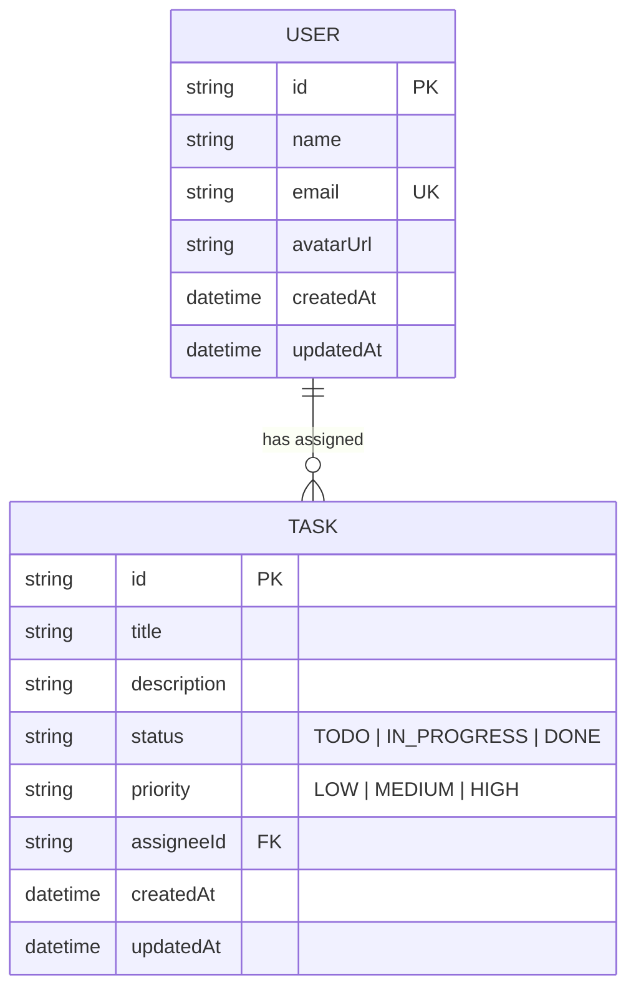

# Team Task Board

A modern full-stack task-tracking web application built for the Senior Full-Stack Engineer assessment. The solution features a **NestJS** REST API with **Prisma ORM** & **SQLite**, comprehensive DTO validation, unit and E2E test suites, and a **React** + **Redux Toolkit** + **Material UI (MUI)** frontend with dark/light mode support.

---

## 🛠️ Tech Stack

- **Frontend**: React 19, TypeScript, Redux Toolkit (RTK Query), Material UI (MUI v6)
- **Backend**: NestJS 11, TypeScript, Prisma ORM 5, class-validator, class-transformer
- **Database**: SQLite (Zero-config local database)
- **Testing**: Jest (Unit testing) & Supertest (E2E Integration testing)

---

## 📊 Data Model & ER Diagram

The data model features a **1-to-many relationship** between `User` (Assignee) and `Task`. A user can be assigned multiple tasks, while each task optionally links to one assigned user.



---

## 🚀 Quick Start Guide

### Prerequisites
- **Node.js**: `v18+` (Tested on Node v24.17)
- **npm**: `v9+`

---

### 1. Backend Setup (`/backend`)

```bash
# Navigate to backend directory
cd backend

# Install dependencies
npm install

# Run Prisma migrations (creates SQLite DB & automatically runs seed script)
npx prisma migrate dev

# (Optional) Re-seed data manually if needed
npx prisma db seed

# Run NestJS dev server (starts on http://localhost:3000)
npm run start:dev
```

#### Running Backend Tests
```bash
# Run unit tests (TasksService)
npm test

# Run E2E integration tests (REST API endpoints)
npm run test:e2e
```

---

### 2. Frontend Setup (`/frontend`)

```bash
# Open a new terminal and navigate to frontend directory
cd frontend

# Install dependencies
npm install

# Start Vite development server (starts on http://localhost:5173)
npm run dev
```

---

## 💡 Decisions & Tradeoffs

1. **State Management & Data Fetching**:
   Selected **Redux Toolkit with RTK Query** over pure local state or context API. RTK Query handles server state caching, automatic tag invalidation (`Task` list and detail tags), and optimistic state updates cleanly without boilerplate.
2. **Database & Schema Design**:
   Used **SQLite with Prisma ORM** to ensure a 100% portable, zero-configuration local database setup. Modeled `status` (`TODO`, `IN_PROGRESS`, `DONE`) and `priority` (`LOW`, `MEDIUM`, `HIGH`) as string attributes with default constraints for seamless SQLite compatibility.
3. **Architecture & Modularization**:
   Structured the NestJS backend strictly into domain modules (`TasksModule`, `UsersModule`, `PrismaModule`) with `class-validator` DTOs and a global validation pipe (`whitelist`, `transform`, `forbidNonWhitelisted`).
4. **Timeboxing & Tradeoffs**:
   Prioritized core decision quality, robust type safety, test coverage, and clear UI design over complex drag-and-drop libraries (e.g. `react-dnd` or `dnd-kit`). Task status transitions are accomplished via responsive card status selectors and Kanban column views. Given more time, I would implement WebSocket / Server-Sent Events (SSE) for multi-client real-time synchronization, user authentication (JWT/OAuth), and pagination for high-volume task boards.

---

## ⏱️ Time Spent

**Total Time Spent**: ~2.5 hours (11:40 AM – 2:10 PM)
- Architecture Planning & NestJS Backend: ~30 mins
- Prisma Schema, SQLite & Seeding: ~30 mins
- Tasks & Users Modules + E2E Tests: ~30 mins
- React, Vite & TypeScript Frontend Setup: ~30 mins
- MUI UI Components & RTK Query Integration: ~24 mins
